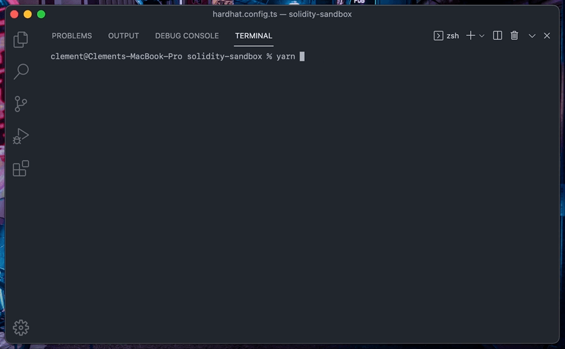
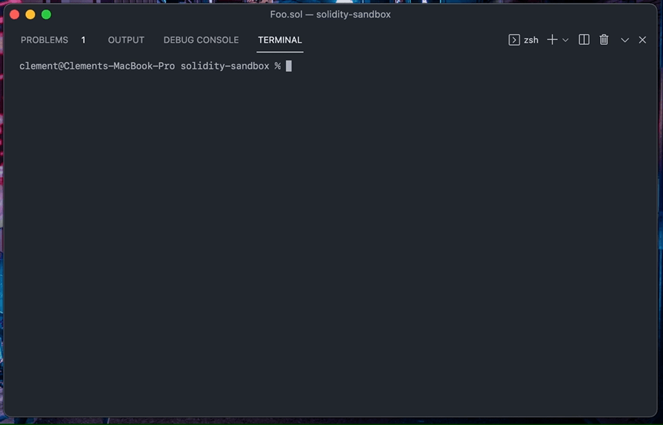
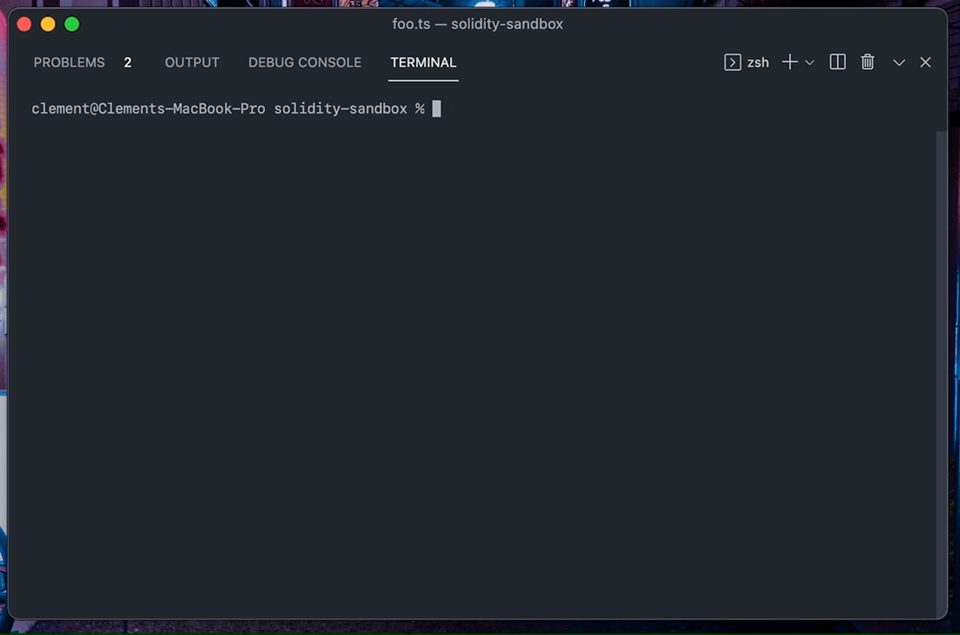

# 🥘 Marmite

   

> Hassle-free Hardhat plugin to compare gas cost among different Solidity code snippets.



## 🧩 Features

- 📊 Compare code snippets directly in your contracts
- ✅ Compatible with any Solidity versions
- 🔍 Checks function calls and contract deployments
- 💯 Accurate gas cost metrics using code preprocessing
- 🧰 Supports single contracts and complex scripts

## 📦 Installation

First thing to do is to install the plugin in your Hardhat project:

```bash
# Using yarn
yarn add @primitivefi/hardhat-marmite

# Or using npm
npm i @primitivefi/hardhat-marmite
```

Next step is simply to include the plugin into your `hardhat.config.js` or `hardhat.config.ts` file:

```typescript
// Using JavaScript
require('@primitivefi/hardhat-marmite');

// Using ES6 or TypeScript
import '@primitivefi/hardhat-marmite';
```

## ⛽️ Usage

Marmite offers 2 different tasks that you can use to compare gas costs:
- `golf:contract` for standalone contracts and simple function calls
- `golf:script` for all the more complex scenarios

In both cases, the first thing to do is always to write the different snippets that you want to compare, these are called the *implementations*.

### ✍️ Solidity implementations

Declaring an implementation is a piece of cake, just put your Solidity code within the tags `@start<Name-of-your-implementation>` and `@end`.

Let's say that you want to know if it's cheaper to check if a variable is "different from 0" or "higher than 0", simply write inside of your contract:

```solidity
// SPDX-License-Identifier: WTFPL
pragma solidity 0.8.9;

contract Foo {
    uint256 public bar;

    function set(uint256 newBar) external {
        // Declaring our first implementation
        @start<Different-from>
        if (newBar != 0) {
            bar = newBar;
        }
        @end

        // Declaring our second implementation
        @start<Greater-than>
        if (newBar > 0) {
            bar = newBar;
        }
        @end
    }
}
```

Marmite will know that it has to compare the gas cost of `Different-from` and `Greater-than`. Under the hood, this contract will be compiled 2 times, using each time the code of a different implementation.

### 📃 `golf:contract`

Standalone contracts and unique function calls can be quickly *gas golf-ed* using this task:

```bash
npx hardhat golf:contract --contract Foo --func set --params 42
```



This will tell Marmite to deploy the contract `Foo` and call the function `set` with the parameter `42`. Note that since no implementation names were specified, Marmite will naively measure all of them.

Here are all the options of the `golf:contract` task:
- `--contract` **(mandatory)**: Name of the contract to deploy, e.g. `Foo`
- `--ctorParams` (optional): Parameters to pass to the constructor during the contract deployment, separated by a comma, e.g. `42,true`
- `--func` **(mandatory)**: Name of the function to call, e.g. `set`
- `--params` (optional): Parameters to pass with the function call, separated by a comma, e.g. `42,true`
- `--impls` (optional): Name of the implementations to compare, separated by a comma, note that if this parameter is missing, all the found implementations will be compared, e.g. `Different-from,Greater-than`

### 📽 `golf:script`

Some more complex scenarios require a script to deploy the contracts or to set up a particular environment, this task is especially made to tackle these cases.

Scripts are very similar to the usual Hardhat tasks, scripts or fixtures, but the only difference is that all the logic must happen inside the Marmite context function:

```typescript
import hre from 'hardhat';
import marmite from '@primitivefi/hardhat-marmite';

async function main() {
  await marmite(hre, async (flag) => {
    const Foo = await hre.ethers.getContractFactory('Foo');
    const foo = await Foo.deploy();

    const tx = await foo.set(42);
    await flag('set function', tx);
  });
}

main();
```

This example is showcasing the important steps to write a script:
1. Import the `marmite` context function
2. Pass the `hre` (Hardhat Runtime Environment) variable to the context function, along with a callback function deploying your contracts and executing your transactions
3. A `flag` function is provided to your callback function as a parameter, use it to pin a transaction whenever you are interested in having its gas cost compared in the final results

Here is a quick API describing these two functions:

#### 🥘 `marmite`

```typescript
/**
 * Marmite context function
 * @param hre Hardhat Runtime Environment variable
 * @param callback Function deploying contracts and flagging transactions
 * @param implementations (optional) Array of implementation names to compare, omitting
 *                        this parameter will compare all the found implementations
 */
export default async function marmite(
  hre: HardhatRuntimeEnvironment,
  callback: CallbackFunction,
  implementations: string[] = [],
): Promise<void>
```

#### 🚩 `flag`

```typescript
/**
 * Flags a transaction to display its gas cost in the final results
 * @param name Name of the flag
 * @param tx Transaction to flag
 */
export type FlagFunction = (name: string, tx: ContractTransaction | TransactionResponse) => void;
```

Once your script is ready, you can run:

```bash
npx hardhat golf:script ./path/to/yourScript.ts
```



This task only takes one unnamed parameter, which is the path to your script, e. g. `./examples/scripts/foo.ts`.

## 🔧 Config

Coming soon 👀

## ⛑ Help

Feel free to open an issue if you need help or if you encounter a problem! Here are some already known problems though:
- Naming a flag `constructor` will create a JS / TS issue
- Compiling your contracts using `npx hardhat compile` might not work if Marmite tags are still present in your code
